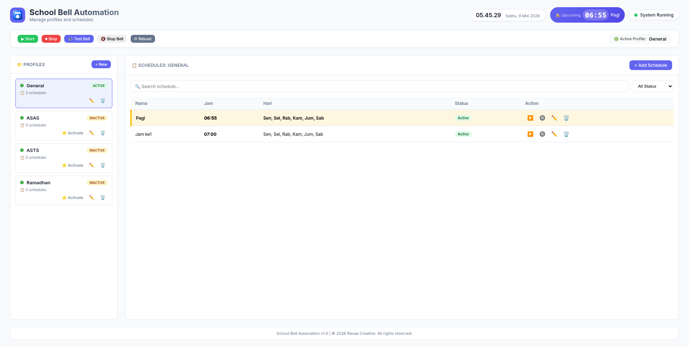
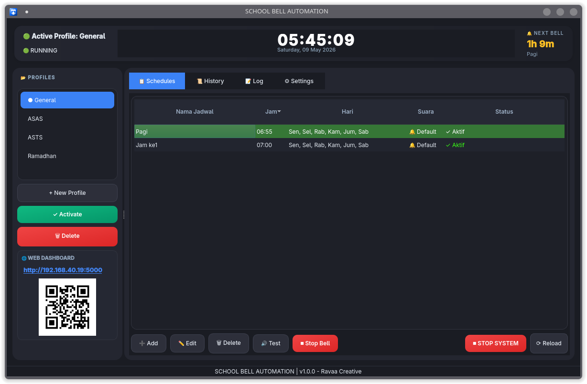
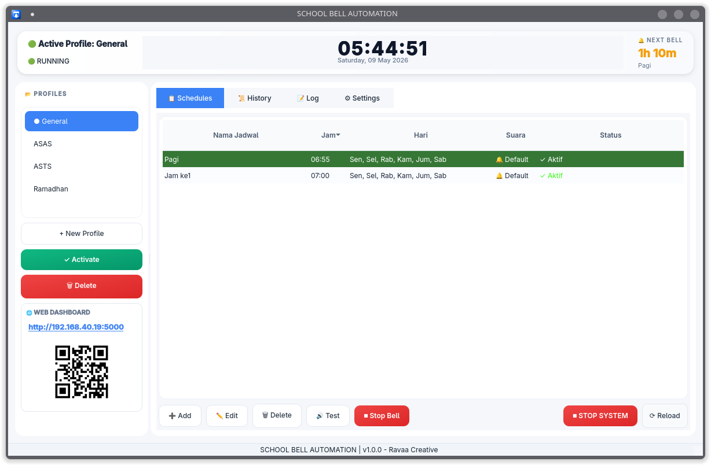

# 🔔 School Bell Automation System


Professional automated school bell management software built with Python, PyQt6, Flask Web Dashboard, APScheduler, and SQLite.

Designed for schools, campuses, and educational institutions to automate bell scheduling and reduce manual operations.

---

# ✨ Features

* 🔔 Automatic bell ringing based on schedules
* 📂 Multiple schedule profiles
* 🌐 Real-time Web Dashboard Control Center
* 🖥 Native Desktop GUI Monitor
* 🔳 QR Code quick access
* 🎵 Custom audio bell support (MP3/WAV/OGG)
* 📜 Bell ringing history logs
* 🔊 Volume control
* ⚡ Manual bell trigger
* 🌗 Dark / Light theme
* 💾 Database backup & restore
* 🔄 Built-in update checker
* 🚀 Linux auto-start service
* 💻 Windows support
* 💾 SQLite lightweight database

---

# 🖼 Interface Preview

## 🌐 Web Dashboard

Modern real-time monitoring dashboard accessible via browser.



---

## 🖥 Desktop Monitor Dark Theme

Native desktop application built with PyQt6.



---

## 🖥 Desktop Monitor Light Theme

Another theme.



---

# 📦 Technology Stack

* Python 3.13
* PyQt6
* Flask + SocketIO
* APScheduler
* SQLAlchemy
* SQLite
* Pygame Audio Engine
* QRCode Generator
* Local Network Detection
* Thread-safe Event System

---

# 🚀 Installation

## GNU/Linux

```bash
git clone https://github.com/kholif18/school-bell.git
cd school-bell
chmod +x install.sh
sudo ./install.sh
```

---

# ▶ Run Application

```bash
./start.sh
```

Then open browser:

```bash
http://localhost:5000
```

Or access from another device in the same network:

```bash
http://YOUR-IP:5000
```

---

# 📱 Mobile Access

The application can be controlled directly from smartphones or tablets connected to the same local network.

Desktop application provides:

* Local IP Address
* Clickable Dashboard URL
* QR Code for instant access

---

# ⚙ Linux Auto Start Service

```bash
sudo systemctl enable schoolbell
sudo systemctl start schoolbell
```

---

# 💻 Supported Platforms

* GNU/Linux ✅
* Windows ✅

---

# 🔄 Updates

Application updates are distributed through GitHub Releases.

Use:

```text
Settings → Check Updates
```

---

# 📁 Project Structure

```bash
core/        # Scheduler engine, database, audio manager
apps/        # Desktop and web applications
assets/      # Audio, icons, images
logs/        # Application logs
db/          # SQLite database
```

---

# 📸 Screenshots

## 🌐 Web Dashboard


---

## 🖥 Dark Theme


---

## 🖥 Light Theme


---

# 📄 License

MIT License

---

# 👨‍💻 Developer

Developed by Ravaa Creative.
