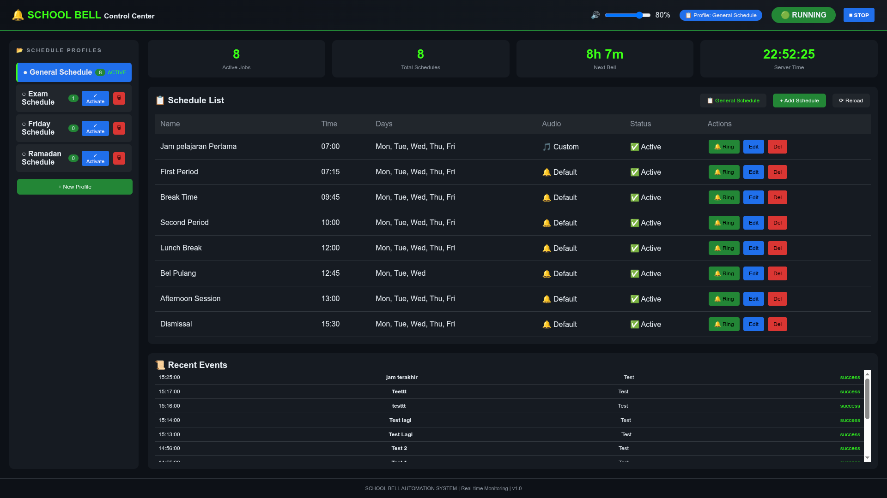
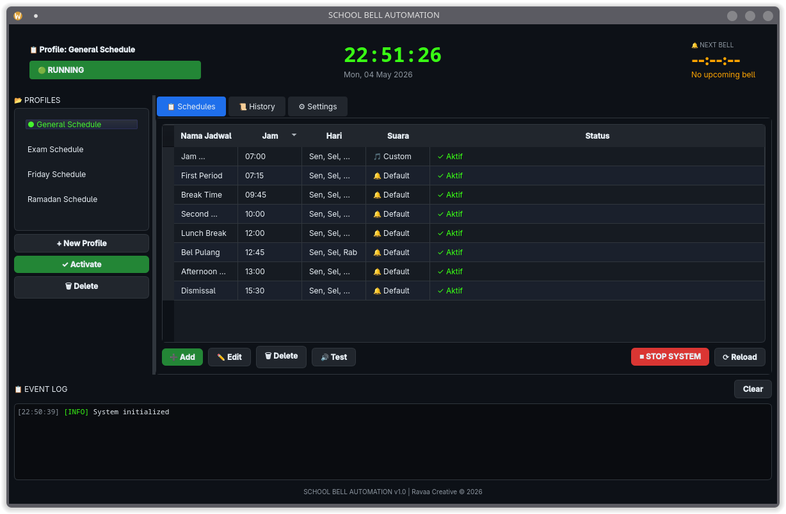

# 🔔 School Bell Automation System

Professional automated school bell management software built with Python, PyQt6, Flask Web Dashboard, APScheduler and SQLite.

---

## ✨ Features

- 🔔 Automatic bell ringing based on schedules
- 📂 Multiple schedule profiles
- 🌐 Real-time Web Dashboard Control Center
- 🖥 Desktop GUI Monitor
- 🎵 Custom audio bell support (MP3/WAV/OGG)
- 📜 Bell ringing history logs
- 🔊 Volume control
- ⚡ Manual ring trigger
- 🚀 Linux auto-start background service
- 💾 SQLite lightweight database

---

## 🖼 Interface Preview

### Web Dashboard
Modern real-time monitoring dashboard accessible via browser.

### Desktop Monitor
Native Linux desktop control window built with PyQt6.

---

## 📦 Technology Stack

- Python 3.13
- PyQt6
- Flask + SocketIO
- APScheduler
- SQLAlchemy
- SQLite
- Pygame Audio Engine

---

## 🚀 Installation

```bash
git clone https://github.com/USERNAME/school-bell-automation.git
cd school-bell-automation
chmod +x install.sh
./install.sh
```

---

## ▶ Run Application

```bash
./start.sh
```

Then open browser:

```bash
http://localhost:5000
```

---

## ⚙ Linux Auto Start Service

```bash
sudo systemctl enable schoolbell
sudo systemctl start schoolbell
```

---

## 📁 Project Structure

```bash
core/        # Scheduler engine, database, audio manager
desktop/     # Desktop GUI
web/         # Flask web dashboard
assets/      # Audio files
db/          # SQLite database
logs/        # System logs
```

---

## 📸 Screenshots

### 🌐 Web Dashboard



---

### 🖥 Desktop Monitor



---

## 📄 License

MIT License

---

## 👨‍💻 Developer

Developed for educational institution automation.
